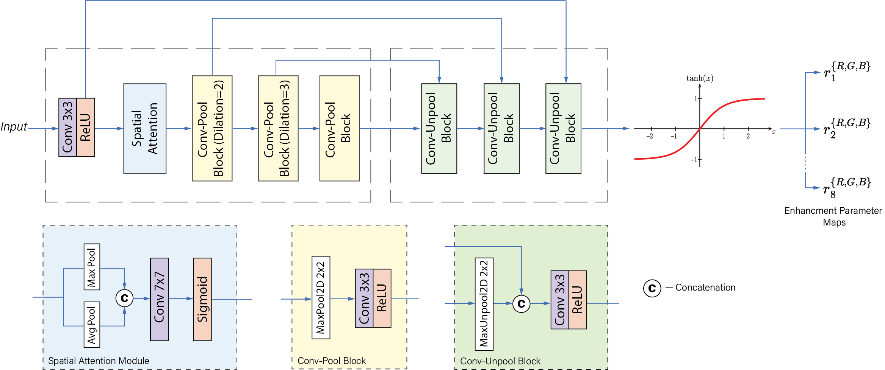
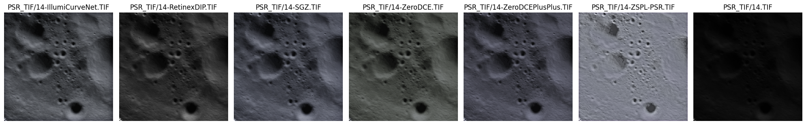

# IllumiCurveNet: Low-Light Image Enhancement for Lunar Permanently Shadowed Regions Using a Self-Guided Loss Framework

## Table of Contents
- [Introduction](#introduction)
- [Architecture](#architecture)
- [Prerequisites](#prerequisites)
- [Installation](#installation)
- [Dataset Preparation](#dataset-preparation)
- [Training](#training)
- [Testing](#testing)
- [Results](#results)
- [Code Structure](#code-structure)

## Introduction
Lunar exploration is hindered by the extreme low-light conditions found in Permanently Shadowed Regions (PSRs). Traditional low-light image enhancement techniques struggle with the unique challenges presented by the lunar environment, such as high noise levels and lack of illumination. **IllumiCurveNet** addresses these challenges by introducing a novel self-guided loss framework and an illumination curve network optimized with an attention mechanism and adaptive gamma correction for enhancing lunar PSR images.

## Citation and Paper
This work has been **accepted for publication at [IJCNN 2025](https://www.ijcnn.org/)**  
> **IllumiCurveNet: Low-Light Image Enhancement for Lunar Permanently Shadowed Regions Using a Self-Guided Loss Framework**  
> [Saksham Jain](https://github.com/sakshamjainwin), *et al.*  
> _Accepted, to appear in the Proceedings of the International Joint Conference on Neural Networks (IJCNN) 2025._

📄 **Paper:** [https://confcats-event-sessions.s3.amazonaws.com/ijcnn25/papers/2823.pdf](#)

## Architecture
IllumiCurveNet combines a multi-scale encoder-decoder architecture with a spatial attention mechanism and an adaptive gamma correction component. The network learns to enhance low-light images through iterative application of learnable enhancement curves and leverages multiple loss functions tailored for this task.


<p align="center"><i>Figure: Overview of the IllumiCurveNet architecture.</i></p>

## Prerequisites
- Python 3.12 or higher
- A CUDA compatible GPU
- [PyTorch](https://pytorch.org/) == 2.5.1
- Numpy
- Pillow
- Jupyter Notebook
- IPykernel (for running the notebook)
- Matplotlib (for running the notebook)
- Pyiqa (for running the notebook)

## Installation
1. **Clone the repository:**

   ```bash
   git clone https://github.com/JustSurWHYving/illumi-curve-net.git
   cd illumi-curve-net
   ```
2. **Create a virtual environment (optional but recommended):**

   ```bash
   python -m venv venv
   source venv/bin/activate  # On Windows, use `venv\Scripts\activate`
   ```
3. **Install the required packages:**
   ```bash
   pip install -r requirements.txt
   pip install torch torchvision torchaudio # For GPU support (Linux)
   ```
   **Note:** If you encounter issues with CUDA compatibility, you may need to install the appropriate version of [PyTorch](https://pytorch.org/) for your system.

## Dataset Preparation
1. **Download the training dataset:**
   [Link](https://www.kaggle.com/datasets/ashishprajapati1306/illumicurvenet-training-data/) to the training dataset.
2. **Organize the dataset:**
   Organize the dataset into the following structure:
   ```
   data/
   ├── train_data/
   │   ├── img1.png
   │   ├── img2.png
   │   └── ...
   └── test_data/
       ├── Folder1 
       ├── Folder2
       └── ...
    ```
    **Note:** The test_data should be organized into folders, each representing a separate test set. Each folder should contain the images for that test set.

## Training
To train the model on your dataset, run the following command:
```bash
python train.py
```
**Training Arguments:**
- `--lowlight_images_path`: Path to the directory containing low-light training images.
- `--pretrain_snapshot`: Pretrained model snapshot.
- `--train_batch_size`: Batch size for training.

**For Example:** To train the model with a batch size of 8 and a pretrained model checkpoint, run:
```bash
python train.py --lowlight_images_path data/train_data --pretrain_snapshot snapshots/model-best.pth --train_batch_size 8
```
## Testing
To test the model on the train dataset, run the following command:
```bash
python test.py
```
**Testing Arguments:**
- `--lowlight_images_path`: Path to the directory having folders containing low-light test images.
- `--pretrain_snapshot`: Pretrained model snapshot.

The enhanced images will be saved in the `result` directory, mirroring the structure of `test_data/`.

## Results
**Quantitative Results:**
The following table shows the performance of IllumiCurveNet on the test dataset compared to other models: (Lower values indicate better performance.)
| Method | Input | Zero-DCE | Zero-DCE++ | ZSPL-PSR | RRDNet | RetinexDIP | IllumiCurveNet |
|---------|--------|-----------|------------|-----------|---------|------------|----------------|
| PIQE↓ | 54.06 | 51.11 | 51.59 | 47.51 | 52.55 | 52.61 | **36.40** |
| NIQE↓ | 12.07 | 9.67 | 9.75 | 9.29 | 10.01 | 9.80 | **8.38** |
| BRISQUE↓ | 56.87 | 45.58 | 46.42 | 54.91 | 43.16 | 43.11 | **36.55** |

**Qualitative Results:**


<p align="center"><i>Figure: Overview of different models on the PSR Images.</i></p>

## Code Structure
- `model.py`: Contains the implementation of the IllumiCurveNet architecture.
- `data/`: Contains training `train_data/` and testing `test_data/` datasets.
- `train.py`: Script to train the IllumiCurveNet model.
- `utils/dataloader.py`: Data loader for training images.
- `utils/losses.py`: Loss functions for model training.
- `snapshots/`: Directory to save the best model checkpoint.
- `test.py`: Script to test the trained model on low-light images.
- `data/result/`: Directory where enhanced images are saved.
